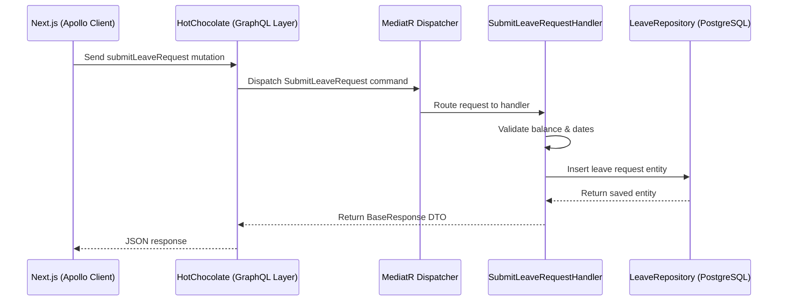

# WorkFlow HRMS: Part 1 - Backend Architecture Setup Report

This report details the modular monolithic architecture of the WorkFlow backend and the initial registration of the 12 core HRMS feature modules.

---

## 1. Modular Monolithic Architecture (Beginner Friendly)

A **Modular Monolith** is like a large apartment building with completely independent, self-contained apartments. 
- The entire building uses the same utility lines (a single database connection and process), but each apartment has its own door, kitchen, and bathroom (decoupled Domain, Business Logic, and Repositories).
- This structure prevents the codebase from becoming spaghetti code. If the `LeaveFeature` needs to change, it does not break the `PayrollFeature` because their codes are isolated.

---

## 2. Directory Structure and Layers

Each of the 12 modules has 4 distinct layers:
1. **Domain:** Defines the database tables (entities) and core enums.
2. **Application:** Contains business logic, DTOs (Data Transfer Objects), request validators, and MediatR handlers.
3. **Infrastructure:** Communicates with PostgreSQL database using repositories.
4. **GraphQL:** Exposes queries and mutations to the frontend.

---

## 3. Example Flow: Submitting a Leave Request

---

## 4. Why This Architecture is Reliable & Performance-Oriented

- **Low Coupling:** Changes are local to the module.
- **Asynchronous Execution:** All handlers and database operations use `async`/`await` to avoid thread blocking.
- **Fail-Fast Validation:** Inbound requests are validated (using FluentValidation rules) before hitting the database, preventing database-level crashes.

---

## 5. Common Backend Errors and Fixes

- **Error: `circular dependency` between projects:**
  - *Fix:* Ensure dependencies always flow downwards: `GraphQL -> Application -> Domain` and `Infrastructure -> Application`. Modules must not depend directly on each other's project references; they should communicate via shared MediatR notifications or database events.
- **Error: `unregistered repository` dependency injection error:**
  - *Fix:* Register the feature dependencies inside `RepositoryRegistration.cs`.

---

## 6. Interview Q&A (Hinglish)

### Q1: App-wide common dependencies ko modular monolith mein kaise control karte hain?
**Answer:**
Common logic (like logging, validation, exceptions, and DB contexts) ko hum `Shared` project foldering mein rakhte hain (jaise `HRMS.Shared.Application` aur `HRMS.Core.Postgres`). Sabhi modules in shared projects ko reference karte hain, jisse code reusability aur consistent standards maintained rehte hain.

### Q2: MediatR use karne ka kya advantage hai?
**Answer:**
MediatR humein Mediator pattern implement karne mein help karta hai. Isse hamare HTTP/GraphQL controllers aur domain services completely decoupled ho jate hain. API layer ko bas request send karni hoti hai, and MediatR automatically command aur queries ko sahi business handlers tak deliver kar deta hai.
